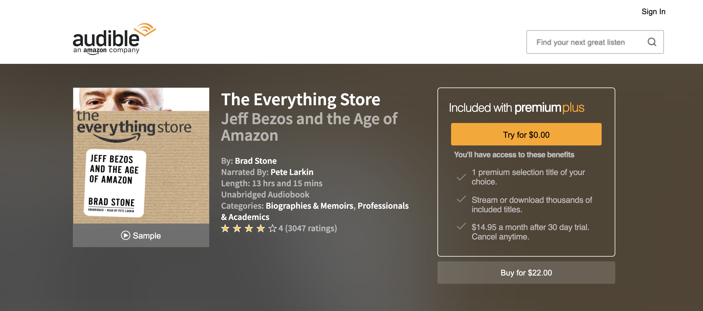

# Price Service
Membership / Book Price Service on Audible

## Table of Contents
- [1.1 Related Projects](#11-related-projects)
- [1.2 Usage ](#12-usage)
- [1.3 Requirements / Set Up](#13-requirements--set-up)
- [1.4 Backlog / Noted Opportunities](#14-backlog--noted-opportunies)

## 1.1 Related Projects
- [Title Service](https://github.com/huang-pei-mei/title-service)
- [Also Enjoyed Service](https://github.com/huang-pei-mei/also-enjoyed-service)
- [Summary Service](https://github.com/huang-pei-mei/FEC-Publishers-Summary)
- [Aggregate Review Service](https://github.com/huang-pei-mei/FEC-Agg.Review)
- [Review Service](https://github.com/huang-pei-mei/reviews-service)

## 1.2 Usage
The Price Service is a fullstack service that provides the price and membership information for an Audible item page.

### 1.2.1 API Endpoints
- GET `/api/price/:bookId`
  - Given a `bookId`, retrieve its price.
- GET `/api/price/:bookTitle`
  - Given a `bookTitle`, retrieve its price.

## 1.3 Requirements / Set Up
**Requirements:**
- Node v14.15.0

### 1.3.1 Install MySQL
1. Follow instructions for your platform in [this link](https://dev.mysql.com/doc/refman/8.0/en/installing.html)
2. Start MySQL: `mysql -u root -p` and enter password specified in step 1

### 1.3.2 Setup Environment Variables
1. Within root directory, create a `.env` file: `touch .env`
2. Open the file and add the `DB_USER` and `DB_PASS` fields to access MySQL

### 1.3.3 Install Dependencies
1. Within root directory, run
`npm install`

### 1.3.4 Start Service
1. Within root directory, create bundle file:
`npm run react-prod`
2. Within root directory, launch server:
`npm start`

## 1.4 Backlog / Noted Opportunies
- Enable RESTful client with path parameters instead of query parameters
- Improve client accessibility